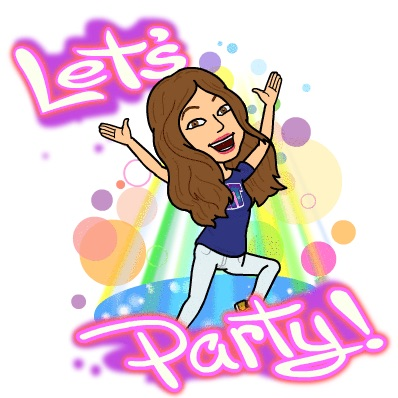
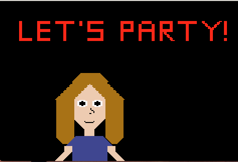
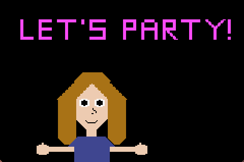

# AnimatedPixel
Assignment for a low level programming class to create an animated pixel for the Gameboy Advanced. 
I decied to recreate the "Let's Party" bitmoji:

This animated pixel has about three frames that shows that the recreated bitmoji is ready to party.

frame3.png
